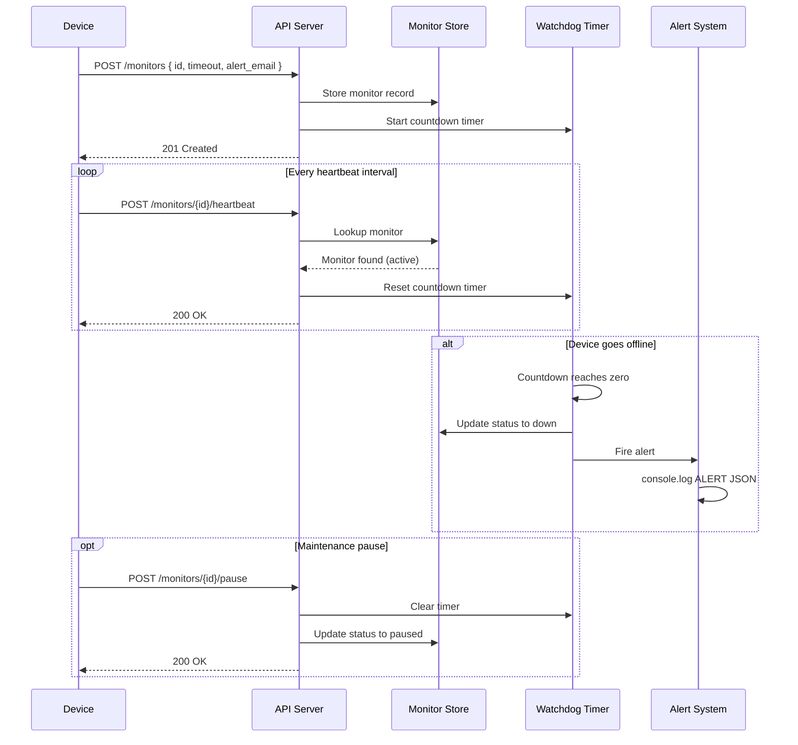

# Pulse Check API — Dead Man's Switch

A backend service that monitors remote devices by tracking heartbeat signals. If a device stops sending heartbeats before its timer expires, the system automatically triggers an alert.

Built with **Python** and **FastAPI**.

---

## Architecture Diagram


---

## Setup Instructions

### Prerequisites
- Python 3.10+

### Installation

1. Clone the repository:
```bash
git clone https://github.com/YOUR_USERNAME/Pulse-Check-API.git
cd Pulse-Check-API
```

2. Create and activate a virtual environment:
```bash
python -m venv venv
venv\Scripts\activate        # Windows
source venv/bin/activate     # macOS/Linux
```

3. Install dependencies:
```bash
pip install -r requirements.txt
```

4. Start the server:
```bash
uvicorn app.main:app --reload
```

The API will be running at `http://127.0.0.1:8000`.  
Interactive docs available at `http://127.0.0.1:8000/docs`.

---

## API Documentation

### POST `/monitors`
Register a new monitor for a device.

**Request body:**
```json
{
  "id": "device-123",
  "timeout": 60,
  "alert_email": "admin@critmon.com"
}
```

**Response `201 Created`:**
```json
{
  "id": "device-123",
  "timeout": 60,
  "alert_email": "admin@critmon.com",
  "status": "active"
}
```

---

### POST `/monitors/{device_id}/heartbeat`
Reset the countdown timer for a device. If the monitor is paused, this will un-pause it and restart the timer.

**Response `200 OK`:**
```json
{
  "id": "device-123",
  "status": "active",
  "message": "Heartbeat received. Timer reset to 60 seconds."
}
```

**Response `404 Not Found`:** Device ID does not exist.

---

### POST `/monitors/{device_id}/pause`
Pause monitoring for a device. No alerts will fire while paused.

**Response `200 OK`:**
```json
{
  "id": "device-123",
  "status": "paused",
  "message": "Monitor 'device-123' paused. No alerts will fire."
}
```

---

### GET `/monitors/{device_id}`
Get the current status of a specific monitor.

**Response `200 OK`:**
```json
{
  "id": "device-123",
  "timeout": 60,
  "alert_email": "admin@critmon.com",
  "status": "active"
}
```

---

### GET `/monitors`
List all registered monitors and their current statuses.

**Response `200 OK`:**
```json
[
  {
    "id": "device-123",
    "timeout": 60,
    "alert_email": "admin@critmon.com",
    "status": "active"
  }
]
```

---

## Developer's Choice: Status & Listing Endpoints

The original spec defined how devices *talk to* the API but left out how operators *query* it. Without a way to check status, a support engineer would have no way to know if a device is `active`, `down`, or `paused` without waiting for an alert to fire.

I added two endpoints to address this:

- `GET /monitors/{device_id}` — lets an operator instantly check the current state of any specific device
- `GET /monitors` — gives a full overview of all registered monitors at once, useful for dashboards or health checks

These make the system genuinely operational rather than just reactive.